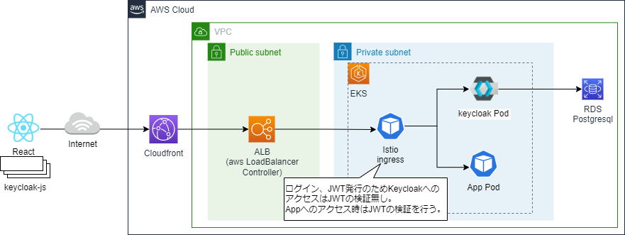
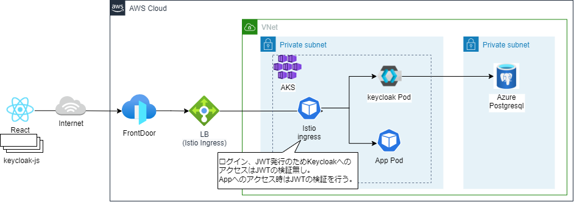

# Auth

## 1. 概要

アプリケーションへのアクセスに認証を導入するため、KeycloakとIstioの導入・設定を行う。Keycloakについては[公式参照](https://www.keycloak.org/)。Istioの認証関連の機能については[公式参照](https://istio.io/latest/docs/reference/config/security/)。サンプルではIstioのIngressでアプリケーションへのアクセスに対して認証を強制し、Keycloakでサインイン、JWTの発行を行う構成にしています。また、Reactのクライアントアプリではkeycloak-jsライブラリを利用して認証制御を行っています。  
AWS

Azure


※istioの認証設定については公式参照([RequestAuthentication](https://istio.io/latest/docs/reference/config/security/request_authentication/)、[Authorization Policy](https://istio.io/latest/docs/reference/config/security/authorization-policy/))。  
※サンプルのrealm設定はkubernetesのSecretとして作成し、deploymentにVolumeMountしてkeycloak起動時にimportしている。VolumeMountを利用するとファイルはシンボリックリンクとなるが、Keycloakの18.0.0ではシンボリックリンクに対応していないためimportできずにエラーになる。initContainerでシンボリックリンクのファイルをコピーして通常のファイルに変換することで対応している。

## 2. 導入

### 2.1 terraformを実行してkeycloakに必要なリソースを作成する。

手順については
[nautible-infra/aws/plugin](https://github.com/nautible/nautible-infra/tree/main/aws/plugin)、[nautible-infra/azure/plugin](https://github.com/nautible/nautible-infra/tree/main/azure/plugin)参照。  

### 2.2 クラウドのシークレット管理サービスに以下の値を登録する。

keycloakはクラウドで管理しているシークレットの値をExternalSecrets経由で参照する。

#### AWS(SecretsManager)

|  シークレット名  | キー |  設定値  |
| ---- | ---- | ---- |
| nautible-plugin-keycloak    | user | keycloakの管理ユーザー |
|                             | password | keycloakの管理ユーザーのパスワード |
| nautible-plugin-keycloak-db | user | keycloakのDBユーザー |
|                             | password| keycloakのDBユーザーのパスワード |
|                             | host| keycloakのDBのHost |

#### Azure(AzureKeyVault)

|  キー |  設定値  |
| ---- | ---- |
| nautible-plugin-keycloak-user | keycloakの管理ユーザー |
| nautible-plugin-keycloak-password | keycloakの管理ユーザーのパスワード |
| nautible-plugin-keycloak-db-user | keycloakのDBユーザー |
| nautible-plugin-keycloak-db-password| keycloakのDBユーザーのパスワード |
| nautible-plugin-keycloak-db-host| keycloakのDBのHost |

### 2.3 SecretStoreを作成する。

#### AWS（SecretsManager）

SecretStoreを作成する。

```bash
ACCOUNT_ID=<AWSアカウントID> && eval "echo \"$(cat auth/overlays/aws/secretstore.yaml)\"" | kubectl apply -f -
```

なお、ロールについてはnautible-infraプロジェクトのaws/plugin/modules/auth/main.tf内にあるauth_secret_access_role及びauth_secret_access_role_policyを参照。（事前にこのロール及びポリシーをTerraformで作成しておく）

#### Azure（AzureKeyVault）

external-secrets-operatorからAzure Key vaultへ接続するためのk8s secretおよびSecretStoreを作成する。詳細については[公式ドキュメント](https://external-secrets.io/)参照。CLIENTIDにはAzureコンソール＞AzureAD＞アプリのアプリケーション (クライアント) IDの値を設定。CLIENTSECRETにはAzureコンソール＞AzureAD＞アプリの登録＞証明書とシークレットでクライアントシークレットを登録して値を設定してください。

```bash
kubectl create secret generic external-secrets-azure-credentials -n keycloak --from-literal=$CLIENTID --from-literal=$CLIENTSECRET
```

SecretStoreを作成する。

TENANT_IDにはAzureコンソール＞AzureAD＞テナントIDの値を設定、AUTH_VAULT_URLにはAzureコンソール＞キー コンテナー＞nautibledevauth＞コンテナーのURIの値を設定してください。

```bash
TENANT_ID=<テナントID> && APP_MS_VAULT_URL=<AzureKeyVaultURL> && eval "echo \"$(cat auth/overlays/azure/secretstore.yaml)\"" | kubectl apply -f -
```

### 2.4 keycloakにインポートするrealmのシークレットを作成する。
```bash
$ kubectl create namespace keycloak
$ kubectl create secret generic secret-keycloak-realm -n keycloak --from-file=auth/base/realm.json
```

### 2.5 環境に合わせてkeycloakの設定を行う。  
kustomizeのpatchで環境個別の設定が必要な値を定義する

AWS  
auth/overlays/aws/kustomization.yaml  
Azure  
auth/overlays/azure/kustomization.yaml

```yaml
# 設定箇所の詳細は「base\keycloak-deploy.yaml」参照。
- op: replace
  path: /spec/template/spec/containers/0/env/0/value
  value: https://dr1d1engi0lfa.cloudfront.net/api/v1.0/nautible-auth/auth #Keycloakのrealm設定のfrontend urlを設定する
- op: replace
  path: /spec/template/spec/containers/0/env/1/value
  value: https://dr1d1engi0lfa.cloudfront.net #Keycloakのclient設定のRoot urlを設定する
# 設定箇所の詳細は「base\keycloak-istio-auth.yaml」参照。
- op: replace
  path: /spec/jwtRules/0/issuer
  value: https://dr1d1engi0lfa.cloudfront.net/api/v1.0/nautible-auth/auth/realms/nautible-auth # istioのRequestAuthentication設定のissuerにkeycloakのURLを指定する
# 設定箇所の詳細は「base\keycloak-istio-auth.yaml」参照。
- op: replace
  path: /spec/rules/0/when/0/values
  value: ["https://dr1d1engi0lfa.cloudfront.net/api/v1.0/nautible-auth/auth/realms/nautible-auth"] # istioのAuthorizationPolicy設定のrequest.auth.claims[iss]にkeycloakのURLを指定する

```
  
### 2.6 デプロイする。
AWS
```bash
$ kubectl apply -f auth/overlays/aws/application.yaml
```

Azure
```bash
$ kubectl apply -f auth/overlays/azure/application.yaml
```

### 2.7 フロントエンドの設定変更と公開。

nautible-app-ms-front/app/.env.auth-sampleの値を環境に合わせて変更し、ファイル名を「.env」に変更する。修正後にcloudfrontに公開する。
```
REACT_APP_AUTH_TYPE=keycloak # 認証設定を有効にするための設定値。keycloak固定。
REACT_APP_AUTH_URL_PREFIX=https://xxx.com/api/v1.0/nautible-auth/auth/ # 認証設定にkeycloakのURLを指定する
```

## 3. 確認

```bash
$ kubectl get deploy -n keycloak
NAME       READY   UP-TO-DATE   AVAILABLE   AGE
keycloak   1/1     1            1           54m
```

## 4. 削除

```
$ kubectl delete -f auth/application.yaml
```
