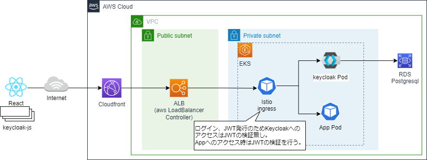

# Auth

## 1. 概要

アプリケーションへのアクセスに認証を導入するため、KeycloakとIstioの導入・設定を行う。Keycloakについては[公式参照](https://www.keycloak.org/)。Istioの認証関連の機能については[公式参照](https://istio.io/latest/docs/reference/config/security/)。サンプルではIstioのIngressでアプリケーションへのアクセスに対して認証を強制し、Keycloakでサインイン、JWTの発行を行う構成にしています。また、Reactのクライアントアプリではkeycloak-jsライブラリを利用して認証制御を行っています。


※サンプルのrealm設定はkubernetesのSecretとして作成し、deploymentにVolumeMountしてkeycloak起動時にimportしている。VolumeMountを利用するとファイルはシンボリックリンクとなるが、Keycloakの18.0.0ではシンボリックリンクに対応していないためimportできずにエラーになる。initContainerでシンボリックリンクのファイルをコピーして通常のファイルに変換することで対応している。

## 2. 導入

### 2.1 terraformを実行してkeycloakに必要なリソースを作成する。手順については
[nautible-infra/aws/plugin](https://github.com/nautible/nautible-infra/tree/main/aws/plugin)、[nautible-infra/azure/plugin](https://github.com/nautible/nautible-infra/tree/main/azure/plugin)参照。  

### 2.2 ssmのパラメータストアに以下の値を登録する。  
keycloakはパラメータストアの値をExternalSecrets経由で参照する。

|  キー  |  設定値  |
| ---- | ---- |
| nautible-infra-keycloak-user | keycloakの管理ユーザー |
| nautible-infra-keycloak-password | keycloakの管理ユーザーのパスワード |
| nautible-infra-keycloak-db-user | keycloakのDBユーザー |
| nautible-infra-keycloak-db-password| keycloakのDBユーザーのパスワード |
| nautible-infra-keycloak-db-host| keycloakのDBのHost |


### 2.3 keycloakにインポートするrealmのシークレットを作成する。
```bash
$ kubectl create namespace keycloak
$ kubectl create secret generic secret-keycloak-realm -n keycloak --from-file=manifests/realm.json
```

### 2.4 環境に合わせてkeycloakの設定を行う。  
keycloak-deploy.yaml
```yaml
- name: KC_IMPORT_VAL_FRONTEND_URL
  value: https://xxx.com/api/v1.0/nautible-auth/auth #Keycloakのfrontend urlを設定する
- name: KC_IMPORT_VAL_ROOR_URL
  value: https://xxx.com #Keycloakのroot urlを設定する
```
keycloak-istio-auth.yaml
```yaml
  jwtRules:
  - issuer: https://xxx.com/api/v1.0/nautible-auth/auth/realms/nautible-auth # issuerにkeycloakのURLを指定する
～略～
    when:
    - key: request.auth.claims[iss]
      values: ["https://xxx.com/api/v1.0/nautible-auth/auth/realms/nautible-auth"] # 認証設定にkeycloakのURLを指定する

```
※istioの認証設定については公式参照([RequestAuthentication](https://istio.io/latest/docs/reference/config/security/request_authentication/)、[Authorization Policy](https://istio.io/latest/docs/reference/config/security/authorization-policy/))。  

### 2.5 デプロイする。

```bash
$ kubectl apply -f auth/application.yaml
```

### 2.6 フロントエンドの設定変更と公開。

nautible-app-ms-front/app/.env.auth-sampleの値を環境に合わせて変更し、ファイル名を「.env」に変更する。修正後にcloudfrontに公開する。
```
REACT_APP_AUTH_TYPE=keycloak # 認証設定を有効にするための設定値。keycloak固定。
REACT_APP_AUTH_URL_PREFIX=https://xxx.com/api/v1.0/nautible-auth/auth/ # 認証設定にkeycloakのURLを指定する
```

## 3. 確認

```bash
$ kubectl get deploy -n keycloak
NAME       READY   UP-TO-DATE   AVAILABLE   AGE
keycloak   1/1     1            1           54m
```

## 4. 削除

```
$ kubectl delete -f auth/application.yaml
```
