# kong-apigateway

## 1. 概要

Kong社が提供するOSSのKong Gatewayにカスタムプラグイン（Severless機能）を追加したAPIGatewayです。本プラグインではAPIGatewayおよび動作確認用のサンプルアプリケーション(consumer)を導入します。

なお、本プラグインは現在AWS環境にのみ対応しています。

### カスタムプラグイン（serverless機能）

バックエンドのアプリケーションコンテナをサーバレス化（未使用時はコンテナ数を０にする）するための機能です。KEDAを使いリクエストがないときはPodを0にし、リクエスト発生時はKongからキューにデータを送ることでPodを起動する仕組みになります。

### 構成図



## 2. 導入

### (1) SNS・SQS環境の準備

SNS・SQSはnautible-infraのTerraformから導入します。

Terraformのコードをclone

```bash
git clone https://github.com/nautible/nautible-infra.git
cd nautible-infra/aws/plugin/env/dev
terraform init
```

variables.tfを確認し不要なプラグインは無効化します。  
※ xxx_variables変数のdefaultを確認

SNS・SQSを導入

```bash
terraform plan
terraform apply
```

### (2) KEDAの準備

[KEDAの導入ドキュメント](https://github.com/nautible/nautible-plugin/tree/main/pod-autoscaler)を参考にして導入します。

### (3) Kong Gatewayの導入

- base/application.yaml

リポジトリおよびタグを標準のkongから変更する。また、Daprおよびプラグインの起動に必要な環境変数を設定します。

```yaml
    helm:
      parameters:
      - name: 'podAnnotations.dapr\.io\/enabled'
        value: 'true'
      - name: 'podAnnotations.dapr\.io\/app-id'
        value: 'serverless'
      - name: 'podAnnotations.dapr\.io\/app-port'
        value: '8000'
      - name: 'podAnnotations.dapr\.io\/enable-api-logging'
        value: 'true'
      - name: 'image.repository'
        value: 'public.ecr.aws/nautible/nautible-kong-serverless'
      - name: 'image.tag'
        value: 'v0.1.5'
      - name: 'env.plugins'
        value: 'bundled, serverless'
      - name: 'env.pluginserver_names'
        value: 'serverless'
      - name: 'env.pluginserver_serverless_query_cmd'
        value: '/usr/local/bin/serverless -dump'
```

※ 標準のKong Gatewayを導入する場合はパラメータをすべて削除してデプロイしてください。

- base/ingress.yaml

バックエンドへのルーティング設定を記述します。また、annotationsにプラグイン設定を記述することで、Ingressでリクエストを受けた際にプラグインに処理を流すことが可能になります。  
サンプルのconsumerアプリの動作確認はこのままで問題ありません。

```yaml
apiVersion: networking.k8s.io/v1
kind: Ingress
metadata:
  name: serverless
  namespace: default
  annotations:
    konghq.com/override: kong-ingress
    konghq.com/plugins: serverless
spec:
  ingressClassName: kong
  rules:
  - http:
      paths:
      - backend:
          service:
            name: consumer
            port:
              number: 8080
        path: /kong/
        pathType: ImplementationSpecific
```

- base/config.yaml

config.yamlでは以下の設定を定義しています。

- count: バックエンドアプリケーションのヘルスチェック回数
- interval: バックエンドアプリケーションのヘルスチェック間隔(msec)
- backend: バックエンドごとの個別定義（複数）
  - target: バックエンドのルーティングパス
  - health: ヘルスチェックパス
  - pubsub: PubSub名
  - topic: PubSubのトピック名

デフォルトの設定値は下記のとおりです。サンプルのconsumerアプリの動作確認はこのままで問題ありません。

```yaml
apiVersion: configuration.konghq.com/v1
kind: KongPlugin
metadata:
  name: serverless
  namespace: default
config:
  count: 300
  interval: 100
  backend:
  - target: /kong
    health: /healthz.html
    pubsub: kong-serverless-plugin
    topic: kong-root-request
plugin: serverless

```

- AWS環境にKong Gatewayをデプロイ

```bash
kubectl apply -f kong-apigateway/overlays/aws/application.yaml
```

- サンプルアプリケーションをデプロイ

```bash
kubectl apply -f kong-apigateway/sample/.
```

## 3. 確認

kongおよびconsumerがデプロイされていることを確認。また、consumerはPod数が0になっていることも確認します。

```text
kubectl get deploy

NAME           READY   UP-TO-DATE   AVAILABLE   AGE
consumer               0/0     0            0           40h
kong-apigateway-kong   1/1     1            1           43m
```

IngressのURLを確認します。

```text
kubectl get ingress

NAME         CLASS   HOSTS   ADDRESS                                                                       PORTS   AGE
serverless   kong    *       xxxxxxxxx-000000.ap-northeast-1.elb.amazonaws.com   80      57m
```

Ingressにリクエストを送信します。

```bash
curl http://<IngressのURL>
```

## 4. 削除

サンプルアプリケーションの削除

```bash
kubectl delete -f kong-apigateway/sample/.
```

Kong Gatewayの削除

```bash
kubectl delete -f kong-apigateway/application.yaml
```

SNS・SQSの削除

nautible-infraのリポジトリで下記を実行

```bash
cd aws/plugin/env/dev
terraform destroy
```

## 5. 参考

### (1) ロードバランサ

HELMでkong Gatewayをデプロイした場合、ロードバランサはデフォルトではインターネット向けのELB（ClassicLoadBalancer）がデプロイされます。内部向けロードバランサやALB、TLS対応などロードバランサをカスタマイズして導入する場合はbase/application.yamlのHELMでパラメータを変更する必要があります。

- 参考：https://github.com/Kong/charts/blob/main/charts/kong/values.yaml

```yaml
proxy:
  # Enable creating a Kubernetes service for the proxy
  enabled: true
  type: LoadBalancer
  # To specify annotations or labels for the proxy service, add them to the respective
  # "annotations" or "labels" dictionaries below.
  annotations: {}
  # If terminating TLS at the ELB, the following annotations can be used
  # "service.beta.kubernetes.io/aws-load-balancer-backend-protocol": "*",
  # "service.beta.kubernetes.io/aws-load-balancer-cross-zone-load-balancing-enabled": "true",
  # "service.beta.kubernetes.io/aws-load-balancer-ssl-cert": "arn:aws:acm:REGION:ACCOUNT:certificate/XXXXXX-XXXXXXX-XXXXXXX-XXXXXXXX",
  # "service.beta.kubernetes.io/aws-load-balancer-ssl-ports": "kong-proxy-tls",
  # "service.beta.kubernetes.io/aws-load-balancer-type": "elb"
  ```

設定項目の詳細は[AWS公式ドキュメント](https://docs.aws.amazon.com/ja_jp/eks/latest/userguide/network-load-balancing.html)を参照してください。

### (2) カスタムプラグインの開発リポジトリ

カスタムプラグインの開発リポジトリは[こちら](https://github.com/nautible/nautible-kong-serverless)

### (3) 導入元の定義ファイル

Kong-APIGatewayはDB不要版の書きマニフェストをベースに導入している。

```bash
https://raw.githubusercontent.com/Kong/kubernetes-ingress-controller/master/deploy/single/all-in-one-dbless.yaml