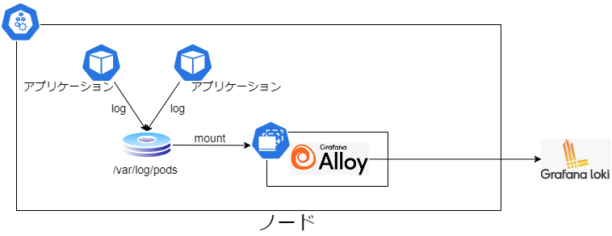

# オブザーバビリティ

## 導入エコシステム

オブザーバビリティでは Grafana プロジェクトをベースとしたモニタリング/ロギング/トレーシングの設定を行う。

- Monitoring
  - Grafana Mimir
- Logging
  - Grafana Loki
- Tracing
  - Grafana Tempo
- Exporter
  - prometheus-node-exporter
  - kube-state-metrics
- OpenTelemetry Collector
  - Grafana Alloy
- View
  - Grafana

## 全体構成図

### モニタリング

ノード情報、Kubernetes のリソース情報、各アプリケーションのステータスを Grafana Alloy から HTTP エンドポイント経由で収集する。収集したメトリクスは Grafana Mimir へ送信する。

なお、エンドポイントのパスは以下の通り。  
※ アプリケーションは実装言語やフレームワークで異なるため、本例では Quarkus のみ参考として紹介。

- prometheus-node-exporter
  - /metrics
- kube-state-metrics
  - /metrics
- Quarkus アプリケーション
  - /q/metrics

### ロギング

Grafana Alloy を Daemonset で配置し、各ノードの Pod ログをマウントして収集する。収集したログデータは Grafana Alloy 上でラベリングをして Grafana Loki へ送信する。

### トレーシング

アプリケーション Pod に導入する自動計装ライブラリから Grafana Alloy へ送信する。収集したデータは Grafana Tempo へ送信する。

なお、Java の自動計装ライブラリでは otlp/http にて送信で行うが、Node.js では otlp/grpc で送信を行うなど、言語ごとにプロトコルが異なる。（それに伴い Grafana Alloy 側の受信ポートが異なる）

通信プロトコルについては、[Auto Instrumentation](https://opentelemetry.io/docs/kubernetes/operator/automatic/)の各言語の Instrumentation リソース例を参照。

## OpenTelemetry

モニタリング情報、ロギング情報、トレース情報の収集構成には OpenTelemetry を利用している。

OpenTelemetry は開発言語ごとにサポート状況が異なるため、最新の状態は[公式サイト](https://opentelemetry.io/docs/languages/)を参照。

## アプリケーションへの OpenTelemetry 導入

アプリケーションへの OpenTelemetry 機能導入には Auto Instrumentation 機能を利用して実現している。

### Auto Instrumentation

マニフェストファイルにアノテーションを付与しておくことで、デプロイ時に OpenTelemetry Operator が自動的に自動計測ライブラリを挿入する機能。

参考：[Auto Instrumentation](https://opentelemetry.io/docs/kubernetes/operator/automatic/)

## 永続化

ローカル環境モードでは外部ストレージへの永続化を行わないため、Pod の削除でデータは削除される。

クラウド環境では各クラウドのオブジェクトストレージに永続化を行う。（Mimir/Loki/Tempo ※Grafana の設定はボリュームストレージ）

## 導入手順

[ローカル環境](./docs/LOCAL.md)

[AWS](./docs/AWS.md)

Azure（TODO）
