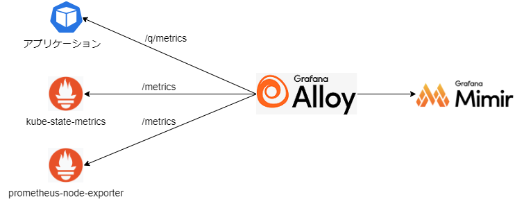
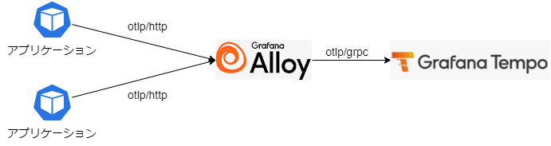

# AWS 環境向け 導入手順

## 1. 全体構成図


### モニタリング

ノード情報、Kubernetes のリソース情報、各アプリケーションのステータスを Grafana Alloy から HTTP エンドポイント経由で収集する。収集したメトリクスは Grafana Mimir へ送信する。



なお、エンドポイントのパスは以下の通り。  
※ アプリケーションは実装言語やフレームワークで異なるため、本例では Quarkus のみ参考として紹介。

- prometheus-node-exporter
  - /metrics
- kube-state-metrics
  - /metrics
- Quarkus アプリケーション
  - /q/metrics

### ロギング

Grafana Alloy を Daemonset で配置し、各ノードの Pod ログをマウントして収集する。収集したログデータは Grafana Alloy 上でラベリングをして Grafana Loki へ送信する。


### トレーシング

アプリケーション Pod に導入する自動計装ライブラリから Grafana Alloy へ送信する。収集したデータは Grafana Tempo へ送信する。



なお、Java の自動計装ライブラリでは otlp/http にて送信で行うが、Node.js では otlp/grpc で送信を行うなど言語ごとにプロトコルが異なる。（それに伴い Grafana Alloy 側の受信ポートが異なる）

通信プロトコルについては、[Auto Instrumentation](https://opentelemetry.io/docs/kubernetes/operator/automatic/)の各言語の Instrumentation リソース例を参照。

## 2. 導入手順

## 2.1 Terraform で必要なリソースを作成

AWS では Grafana Mimir / Loki / Tempo のデータを S3 上に永続化するように設定を行う。必要な S3 バケット作成及び権限設定を Terraform で実施する。

// TODO 参照先

### 2.2 ServiceAccount の登録

Grafana Loki / Grafana Tempo / Grafana Mimir に S3 へのアクセス権限を付与するため、ServiceAccount の登録を行う。

```bash
kubectl apply -f observation/cloud/overlays/aws/namespace.yaml
ACCOUNT_ID=<AWSアカウントID> && eval "echo \"$(cat observation/overlays/aws/serviceaccount.yaml)\"" | kubectl apply -f -
```

なお、本手順では GitHub 上のコミットファイルに AWS ACCOUNT_ID を含めない前提の手順としているため、serviceaccount.yaml の登録を手動で行っている。コミットファイルに AWS ACCOUNT_ID を含めてもいい環境の場合は、observation/cloud/overlays/aws/{loki-patch.yaml|tempo-patch.yaml|mimir-patch.yaml} の HELM パラメータを以下のように変更することで、本手順はスキップできる。

```
serviceAccount:
  create: true
  name: {loki-sa|tempo-sa|mimir-sa}
  annotations:
    eks.amazonaws.com/role-arn: arn:aws:iam::<ACCOUNT_ID>:role/<ロール名>
```

### 2.3 エコシステムの導入

#### Grafana Alloy の設定変更

Grafana Alloy の設定は下記 ConfigMap で実施している。各導入環境に合わせて設定内容を変更する。

```bash
observation/cloud/base/alloy/alloy-config.yaml
```

#### HELM の設定変更

各エコシステムの HELM パ r メータについても必要に応じて変更を行う。デフォルトでは以下の設定としている。

- observation/cloud/base/alloy.yaml
  - 受信ポート指定
  - ログマウント指定
  - configMap 指定
- observation/cloud/base/otel/operator.yaml
  - コレクタのリポジトリ指定
- observation/overlays/aws/grafana-patch.yaml
  - 設定の永続化設定（2G のボリュームをマウント）
- observation/overlays/aws/loki-patch.yaml
  - 認証不要
  - S3 への永続設定
  - レプリカ設定（すべて 1）
- observation/overlays/aws/mimir-patch.yaml
  - S3 への永続設定
  - レプリカ設定（すべて 1）
- observation/overlays/aws/tempo-patch.yaml
  - マイクロサービスモードの HELM チャートを利用
  - S3 への永続設定
  - レプリカ設定（ingester 2、その他 1 ※ ingester は最低 2 となっている）

#### エコシステムのデプロイ

```bash
kubectl apply -f common/priorityclass.yaml
kubectl apply -f observation/cloud/overlays/aws/application.yaml
```

### 2.4 Auto Instrumentation の有効化

計測を行う namespace に対して Instrumentation リソースをデプロイする。  
サンプルは nautible-app-examples に対して有効化している。

```bash
kubectl apply -f observation/examples/instrumentation/nautible-app-examples.yaml
```

### 2.5 アプリケーションへのアノテーション付与

自動計装ライブラリを挿入するアプリケーションの Deployment にアノテーションを付与する。

[nautible-app-examples-java](https://github.com/nautible/nautible-app-examples-manifest/blob/main/nautible-app-examples-manifest-java/base/examples-deployment.yaml) の例

```
apiVersion: apps/v1
kind: Deployment
metadata:
  name: nautible-app-examples-java
  namespace: nautible-app-examples
...
spec:
  replicas: 2
  selector:
    matchLabels:
      app.kubernetes.io/instance: nautible-app-examples-java
      app.kubernetes.io/component: app
  template:
    metadata:
      annotations:
        instrumentation.opentelemetry.io/inject-java: 'true'
...
```

### 2.6 アプリケーションのデプロイ

上記修正したマニフェストをデプロイする。

## 3. 削除

### 3.1 Instrumentation リソースの削除

```bash
kubectl delete -f observation/examples/instrumentation/nautible-app-examples.yaml
```

### 3.2 その他リソースの削除

ArgoCD のコンソール画面より observation の削除を行う。

コマンドラインによる削除を行う場合は、Argo CD CLI を使用して Application リソースを削除する。

```
argocd app delete argocd/observation
```

※ Grafana Loki のポッドは削除に時間がかかるケースがある。

### 3.3 ServiceAccount の削除

```bash
kubectl delete -f observation/overlays/aws/serviceaccount.yaml
```

### 3.4 Namespace の削除

```bash
kubectl delete -f observation/overlays/aws/namespace.yaml
```

### 3.5 AWS リソースの削除

永続データを保存している S3 およびアクセス用のロールを削除する。  
削除の際は必要に応じて S3 の内容をバックアップする。

### 3.6 nautible-infra で作成した IAM ロールの削除

nautible-infra

```bash
cd aws/plugin/env/dev
terraform destroy
```

※ 他のプラグイン用の環境を残す場合は destroy ではなく variables.tf を編集して terraform apply すること。
