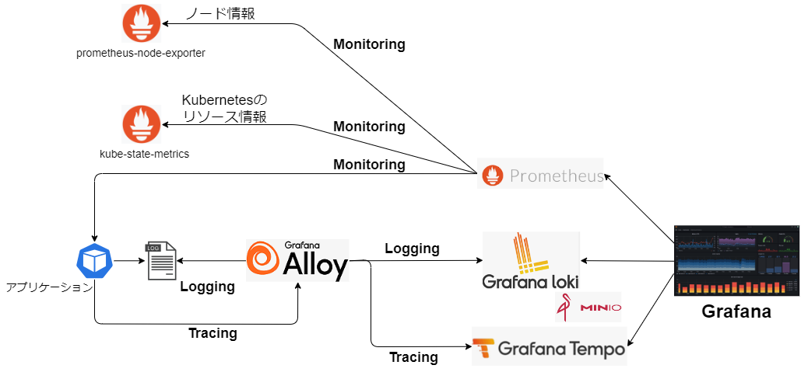

# ローカル環境向け 導入手順

## 1. 全体構成図



### モニタリング

ノード情報、Kubernetes のリソース情報、各アプリケーションのメトリクスを Prometheus からスクレイピングする。


なお、エンドポイントのパスは以下の通り。  
※ アプリケーションは実装言語やフレームワークで異なるため、本例では Quarkus のみ参考として紹介。

- prometheus-node-exporter
  - /metrics
- kube-state-metrics
  - /metrics
- Quarkus アプリケーション
  - /q/metrics

### ロギング

Grafana Alloy を Daemonset で配置し、各ノードの Pod ログをマウントして収集する。収集したログデータは Grafana Alloy 上でラベリングをして Grafana Loki へ送信する。


### トレーシング

アプリケーション Pod に導入する自動計装ライブラリから Grafana Alloy へ送信する。収集したデータは Grafana Tempo へ送信する。


なお、Java の自動計装ライブラリでは otlp/http にて送信で行うが、Node.js では otlp/grpc で送信を行うなど言語ごとにプロトコルが異なる。（それに伴い Grafana Alloy 側の受信ポートが異なる）

通信プロトコルについては、[Auto Instrumentation](https://opentelemetry.io/docs/kubernetes/operator/automatic/)の各言語の Instrumentation リソース例を参照。

## 2. 導入手順

### 2.1 エコシステムの導入

#### Grafana Alloy の設定変更

Grafana Alloy の設定は下記 ConfigMap で実施している。各導入環境に合わせて設定内容を変更する。

```bash
observation/local/manifests/alloy-config.yaml
```

#### HELM の設定変更

各エコシステムの HELM パ r メータについても必要に応じて変更を行う。デフォルトでは以下の設定としている。

- observation/local/manifests/alloy.yaml
  - 受信ポート指定
  - ログマウント指定
  - configMap 指定
- observation/local/manifests/grafana.yaml
  - デフォルト
- observation/local/manifests/loki.yaml
  - 認証不要
  - ストレージ設定
  - レプリカ設定（すべて 1）
- observation/local/manifests/operator.yaml
  - コレクタのリポジトリ指定
- observation/local/manifests/prometheus.yaml
  - スクレイプ設定
- observation/local/manifests/tempo.yaml
  - シングルバイナリモードの HELM チャートを利用

#### エコシステムのデプロイ

```bash
kubectl create ns monitoring
kubectl apply -f observation/local/manifests/.
```

## 3. 削除

### 3.1 Instrumentation リソースの削除

```bash
kubectl delete -f observation/examples/instrumentation/nautible-app-examples.yaml
```

### 3.2 その他リソースの削除

ArgoCD のコンソール画面より 各エコシステム の削除を行う。

コマンドラインによる削除を行う場合は、Argo CD CLI を使用して Application リソースを削除する。

```
argocd app delete argocd/alloy
argocd app delete argocd/grafana
argocd app delete argocd/loki
argocd app delete argocd/prometheus
argocd app delete argocd/tempo
argocd app delete argocd/opentelemetry-operator
```
