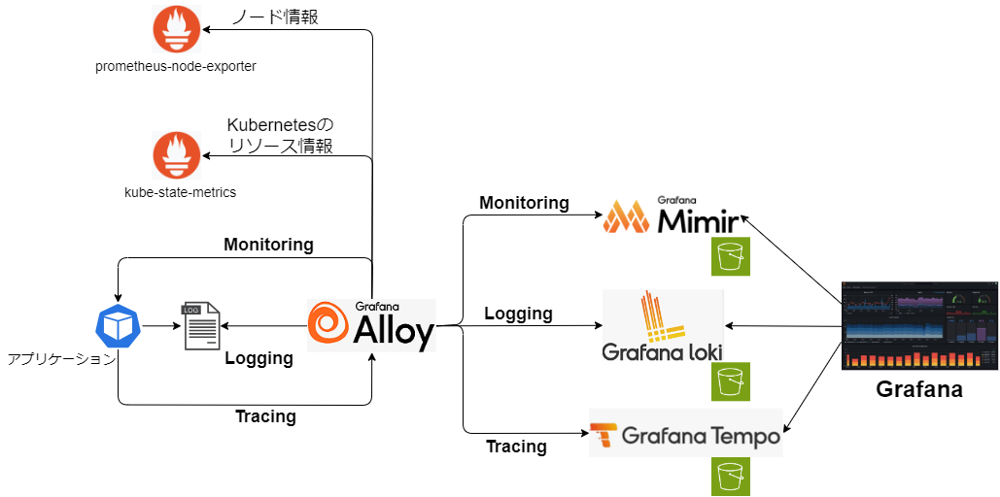

# AWS 環境向け 導入手順

## 1. 全体構成図



### モニタリング

ノード情報、Kubernetes のリソース情報、各アプリケーションのステータスを Grafana Alloy から HTTP エンドポイント経由で収集する。収集したメトリクスは Grafana Mimir へ送信する。


なお、エンドポイントのパスは以下の通り。  
※ アプリケーションは実装言語やフレームワークで異なるため、本例では Quarkus のみ参考として紹介。

- prometheus-node-exporter
  - /metrics
- kube-state-metrics
  - /metrics
- Quarkus アプリケーション
  - /q/metrics

### ロギング

Grafana Alloy を Daemonset で配置し、各ノードの Pod ログをマウントして収集する。収集したログデータは Grafana Loki へ送信する。


### トレーシング

アプリケーション Pod に導入する自動計装ライブラリから Grafana Alloy へ送信する。収集したデータは Grafana Tempo へ送信する。


なお、Java の自動計装ライブラリでは otlp/http にて送信で行うが、Node.js では otlp/grpc で送信を行うなど言語ごとにプロトコルが異なる。（それに伴い Grafana Alloy 側の受信ポートが異なる）

通信プロトコルについては、[Auto Instrumentation](https://opentelemetry.io/docs/kubernetes/operator/automatic/)の各言語の Instrumentation リソース例を参照。

### 永続化

AWS 環境では、Grafana Mimir / Loki / Tempo の長期保管データを S3 へ永続化する。
また、データ格納前のログファイル（WAL）は出力先として EBS をマウントしてローカルに出力する。

## 2. 導入手順

## 2.1 Terraform で必要なリソースを作成

AWS では Grafana Mimir / Loki / Tempo のデータを S3 上に永続化するように設定を行う。必要な S3 バケット作成及び権限設定を Terraform で実施する。

// TODO 参照先

### 2.2 ServiceAccount の登録

Grafana Loki / Grafana Tempo / Grafana Mimir に S3 へのアクセス権限を付与するため、ServiceAccount の登録を行う。

```bash
kubectl apply -f observation/overlays/aws/namespace.yaml
ACCOUNT_ID=<AWSアカウントID> && eval "echo \"$(cat observation/overlays/aws/serviceaccount.yaml)\"" | kubectl apply -f -
```

なお、本手順では GitHub 上のコミットファイルに AWS ACCOUNT_ID を含めない前提の手順としているため、serviceaccount.yaml の登録を手動で行っている。コミットファイルに AWS ACCOUNT_ID を含めてもいい環境の場合は、observation/overlays/aws/{loki/patch.yaml|tempo/patch.yaml|mimir/application.yaml} の HELM パラメータを以下のように変更することで、本手順はスキップできる。

```
serviceAccount:
  create: true
  name: {loki-sa|tempo-sa|mimir-sa}
  annotations:
    eks.amazonaws.com/role-arn: arn:aws:iam::<ACCOUNT_ID>:role/<ロール名>
```

### 2.3 エコシステムの導入

#### Grafana Alloy の設定変更

Grafana Alloy の設定は下記 ConfigMap で実施している。各導入環境に合わせて設定内容を変更する。

```bash
observation/overlays/aws/alloy/config.yaml
```

設定の詳細については[公式ドキュメント](https://grafana.com/docs/alloy/latest/reference/)を参照

#### HELM の設定変更

各エコシステムの HELM パラメータついても必要に応じて変更を行う。AWS 向けにはデフォルトで以下の設定としている。

- observation/overlays/aws/grafana/patch.yaml
  - 設定の永続化設定（2G のボリュームをマウント）
- observation/overlays/aws/loki/patch.yaml
  - 認証不要
  - S3 への永続設定
  - レプリカ設定（すべて 1）
  - キャッシュ無効化
- observation/overlays/aws/mimir/application.yaml
  - S3 への永続設定
  - レプリカ設定（すべて 1）
- observation/overlays/aws/tempo/patch.yaml
  - シングルバイナリモードの HELM チャートを利用（マイクロサービスモードの場合は tempo-distributed チャート を利用する）
  - S3 への永続設定

#### エコシステムのデプロイ

```bash
kubectl apply -f observation/overlays/aws/application.yaml
```
