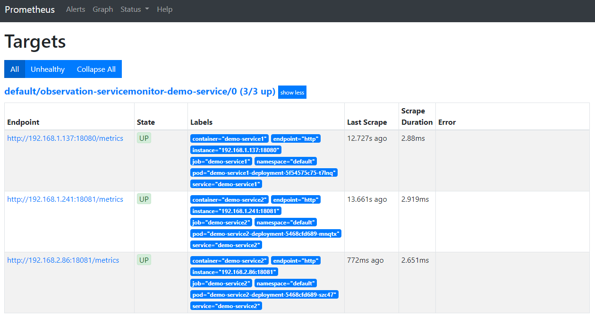

# 独自の監視対象を追加する

## ServiceMonitorアーキテクチャ

PrometheusがServiceMonitorを検出し、ServiceMonitorが各サービスを検出するアーキテクチャとなる。  
検出はラベルを使って制御する。  


[出典：prometheus-operator](https://github.com/prometheus-operator/prometheus-operator/blob/master/Documentation/user-guides/getting-started.md)

## アプリケーションの対応

アプリケーション独自のメトリクスを公開する場合、エンドポイント/metricsを公開する。

golangの例  
HTTPリクエストが来るたびにカウンタをインクリメントし、http_request_totalの名前でリクエスト数を公開する  

```go
package main

import (
    "fmt"
    "io/ioutil"
    "net/http"
    "github.com/prometheus/client_golang/prometheus"
    "github.com/prometheus/client_golang/prometheus/promhttp"
)

var (
    httpReqs = prometheus.NewCounterVec(
            prometheus.CounterOpts{
                    Name: "http_request_total",
                    Help: "How many HTTP requests processed, partitioned by status code and HTTP method.",
            },
            []string{"code", "method"},
    )
)

func init() {
    prometheus.MustRegister(httpReqs)
}

func metrics(w http.ResponseWriter, r *http.Request) {
    promhttp.Handler().ServeHTTP(w, r)
}

func handler(w http.ResponseWriter, r *http.Request) {
    m := httpReqs.WithLabelValues("200", "GET")
    m.Inc()
...
```

## ServiceMonitorの作成

defaultネームスペースでservice: demoのラベルを持つサービスをモニターする例  

```yaml
apiVersion: monitoring.coreos.com/v1
kind: ServiceMonitor

metadata:
  name: observation-servicemonitor-demo-service
  namespace: default
  labels:
    serviceapp: demo-service
    release: prometheus-operator
spec:
  selector:
    matchLabels:
      service: demo       # モニター対象のサービスを特定する(endpointsリソースのラベルを指定)
  endpoints:
  - port: http            # ポート（サービスのspec.ports.name）
    interval: 30s
  namespaceSelector:
    matchNames:
    - default             # モニター対象のネームスペース
```

なお、追加したServiceMonitorをPromentuesに認識させるにはラベルをPrometheusリソースで指定しているserviceMonitorSelectorに一致させる必要がある。（デフォルトは未設定なのですべて認識される）

セレクタを指定する場合はobservation/prometheus-operator/manifests/prometheus-prometheus.yamlのserviceMonitorSelectorにルールを記載する。

例）

```yaml
...
    serviceMonitorSelector:
      matchLabels:
        release: prometheus-operator
...
```

アプリケーション側は下記のようにapp: demoのラベルを持つServiceでデプロイする

```yaml
apiVersion: v1
kind: Service
metadata:
  creationTimestamp: null
  labels:
    service: demo
    app: demo-service1
  name: demo-service1
spec:
  ports:
  - name: http
    port: 18080
    protocol: TCP
    targetPort: 18080
  selector:
    app: demo-service1
  type: ClusterIP
status:
  loadBalancer: {}

```

上記ServiceMonitorをデプロイすると、下記のようにPrometheusのTargetに表示される


