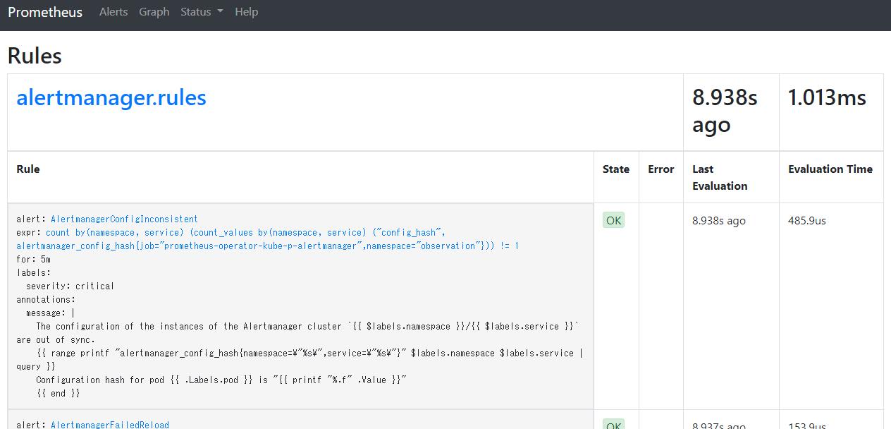
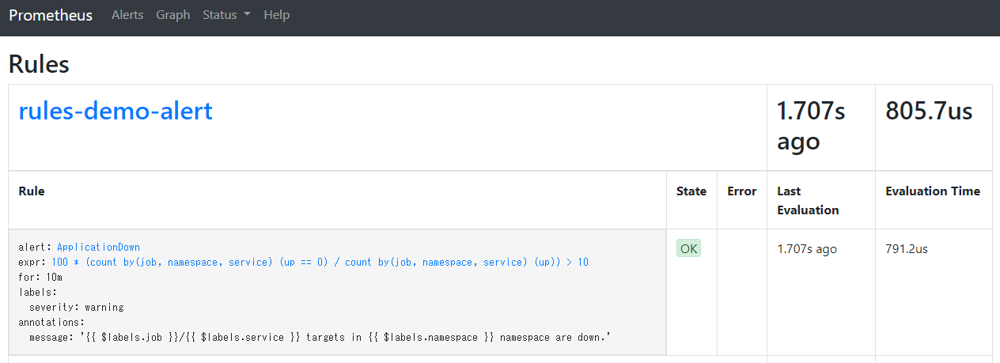

# 監視ルールを追加する

## デプロイされているルールの一覧

```bash
kubectl get prometheusrules -n monitoring

NAME                              AGE
alertmanager-main-rules           27d
kube-prometheus-rules             27d
kube-state-metrics-rules          27d
kubernetes-monitoring-rules       27d
node-exporter-rules               27d
prometheus-k8s-prometheus-rules   27d
prometheus-operator-rules         27d
```

Prometheusの画面からでも確認できる（Status->Rules）



## ルールの追加

「kind: PrometheusRule」のカスタムリソースを作成することでルールを追加することができる。

```yaml
apiVersion: monitoring.coreos.com/v1
kind: PrometheusRule
metadata:
  name: demo-alert.rules
  namespace: monitoring
  labels:
    app.kubernetes.io/name: kube-prometheus
    app.kubernetes.io/part-of: kube-prometheus
    prometheus: k8s
    role: alert-rules
spec:
  groups:
  - name: rules-demo-alert1
    rules:
    - alert: ApplicationDown
      expr: >-
          100 * (count(up == 0) BY (job, namespace, service) / count(up) BY (job, namespace, service)) > 10
      for: 5m
      labels:
        severity: critical
      annotations:
        message: >-
          {{ $labels.job }}/{{ $labels.service }} targets in {{ $labels.namespace }} namespace are down.
  - name: rules-demo-alert2
    rules:
    - alert: ApplicationError
      expr: >-
          count (promtail_custom_log_error_total) > 0
      for: 1m
      labels:
        severity: critical
      annotations:
        message: >-
          {{ $labels.job }}/{{ $labels.service }} targets in {{ $labels.namespace }} namespace are application error.
```

なお、追加したルールをPromentuesに認識させるにはラベルをPrometheusリソースで指定しているruleSelectorに一致させる必要がある。（デフォルトは未設定なのですべて認識される）

セレクタを指定する場合はobservation/prometheus-operator/manifests/prometheus-prometheus.yamlのruleSelectorにルールを記載する。

例）

```yaml
...
ruleSelector:
      matchLabels:
        app: nautible-app-ms
...
```

カスタムリソースをデプロイしてしばらくするとPrometheusのRulesに検出される



## デフォルトの監視ルールを無効化する

observation/prometheus-operator/manifests/配下にデフォルトでいくつかPrometheusRuleファイルが用意されている。無効化する場合はこれらのファイルを削除しておく。
