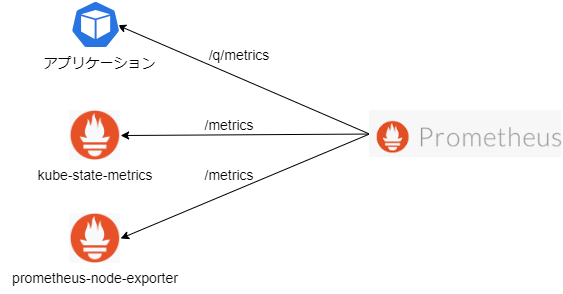
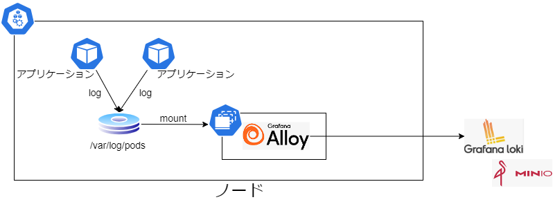

# ローカル環境向け 導入手順

## 1. 全体構成図


### モニタリング

ノード情報、Kubernetes のリソース情報、各アプリケーションのメトリクスを Prometheus からスクレイピングする。



なお、エンドポイントのパスは以下の通り。  
※ アプリケーションは実装言語やフレームワークで異なるため、本例では Quarkus のみ参考として紹介。

- prometheus-node-exporter
  - /metrics
- kube-state-metrics
  - /metrics
- Quarkus アプリケーション
  - /q/metrics

### ロギング

Grafana Alloy を Daemonset で配置し、各ノードの Pod ログをマウントして収集する。収集したログデータは Grafana Loki へ送信する。



### トレーシング

アプリケーション Pod に導入する自動計装ライブラリから Grafana Alloy へ送信する。収集したデータは Grafana Tempo へ送信する。


なお、Java の自動計装ライブラリでは otlp/http にて送信で行うが、Node.js では otlp/grpc で送信を行うなど言語ごとにプロトコルが異なる。（それに伴い Grafana Alloy 側の受信ポートが異なる）

通信プロトコルについては、[Auto Instrumentation](https://opentelemetry.io/docs/kubernetes/operator/automatic/)の各言語の Instrumentation リソース例を参照。

## 2. 導入手順

### 2.1 エコシステムの導入

#### Grafana Alloy の設定変更

Grafana Alloy の設定は下記 ConfigMap で実施している。各導入環境に合わせて設定内容を変更する。

```bash
observation/overlays/local/alloy/config.yaml
```

#### HELM の設定変更

各エコシステムの HELM パラメータについても必要に応じて変更を行う。デフォルトでは以下の設定としている。

- observation/overlays/aws/grafana/patch.yaml
  - 設定の永続化設定（1G のボリュームをマウント）
- observation/overlays/aws/loki/patch.yaml
  - 認証不要
  - minio への永続設定
  - レプリカ設定（すべて 1）
  - キャッシュ無効化
  - ストレージサイズ変更（2Gi）
- observation/overlays/local/prometheus/application.yaml
  - スクレイプ設定
  - ストレージサイズ変更（2Gi）

#### エコシステムのデプロイ

```bash
kubectl apply -f observation/overlays/local/application.yaml.
```
