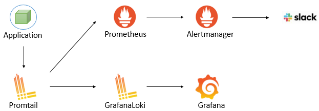
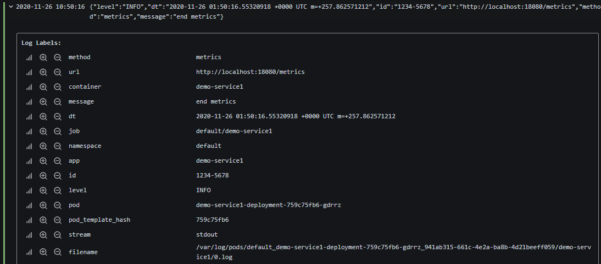
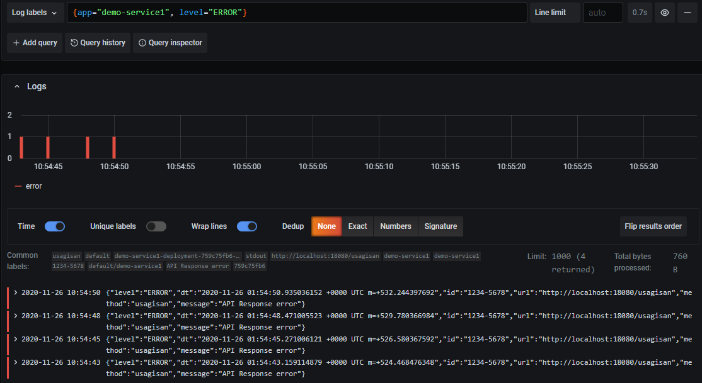
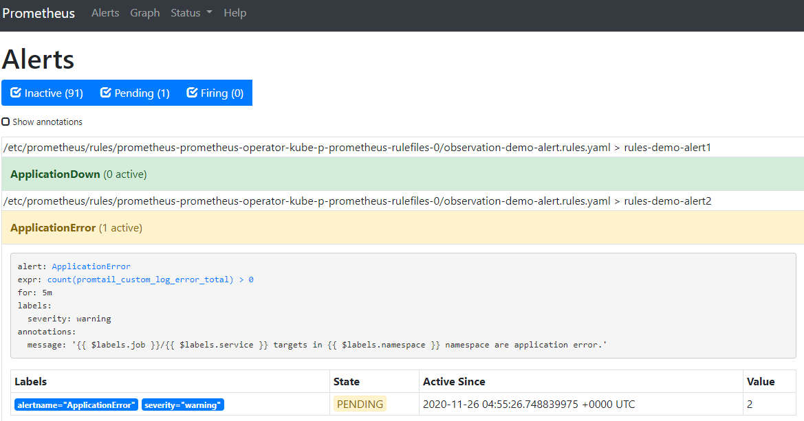
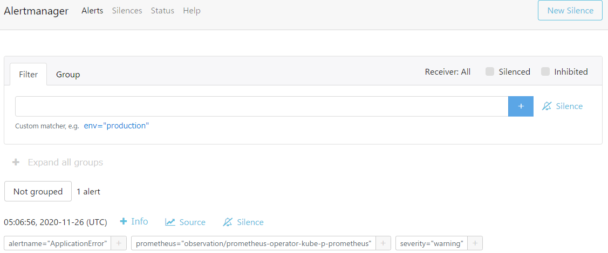

# ロギング

## ロギングアーキテクチャ

ログは各ノード上でPromtailが収集し、GrafanaLokiで格納する。ログによるアラートはPromtailのルールに記載し、Prometheus経由でAlertManagerへ送信する。



## GrafanaLokiアーキテクチャ

GrafanaLokiはgateway,read,writeコンポーネントで構成されており、PromtailやGrafanaはgatewayに接続することでログデータへアクセスする。（以前はlokiコンポートネントのみだったため、古い情報に注意）


出典：[GrafanaLoki公式ドキュメント](https://grafana.com/docs/loki/latest/getting-started/)

## アプリケーション側のログ出力

アプリケーション側ではJSONで構造化したログを出力する。  
構造化するフォーマットはアプリケーションごとに自由に項目を設定するのではなく、プロジェクト全体でいくつか定義を定めて管理するほうが運用しやすいと考えられる。  

- ログの例

```yaml
{
  "level": "INFO",
  "dt": "2020/11/01T12:00:00+0900,
  "id": "1234-5678",
  "url": "https://example.com/service/",
  "method": "serviceApplication",
  "message": "trace start" 
}
```

※ 見やすいように改行しているが、実際のログは改行コードを含まずに出力する（改行するとそこで別のログとして扱われる）

## Promtailの設定

observation/base/promtail/application.yaml

### 接続先設定

kube-prometheus-stackをHEMLからインストールした場合、Lokiのサービス名はloki-gatewayとなる。promtailのデフォルト値もloki-gatewayとなっているが、変更する場合は下記項目を修正する。

```yaml
        config:
          clients:
          - url: http://loki-gateway/loki/api/v1/push
```

### ルール設定

pipelineStagesを設定することでログ取得時のラベリングやメトリクスの設定を行う。

```yaml
...
        pipelineStages:
        - docker:
        - match:
            selector: '{app=~"demo-.*"}' # マッチングするPodの選択
            stages:
            - json:                      # JSONの定義（右辺にはJSONで定義している項目名、左辺は本Stageで扱う変数）
                expressions:
                  level: level
                  dt: dt
                  id: id
                  url: url
                  method: method
                  message: message
            - labels:                    # ラベルの付与（expressionsの左辺と同じ名前にしておけば右辺は省略可）
                level:
                dt:
                id:
                url:
                method:
                message:
            - metrics:                   # メトリクス設定（levelにERRORが入ってたらカウントアップするメトリクス例）
                log_error_total:
                  type: Counter
                  description: error number
                  prefix: promtail_custom_
                  source: level
                  config:
                    value: ERROR
                    action: inc
...
```

なお、ログを非構造のテキストで出力している場合、stagesの「json」を「regex」にすることで正規表現で項目を抽出できる。  
ただし、正規表現は一見で理解することが難しくなることが多く不具合を含みやすいため、構造化ログを推奨する。

## Grafanaでログの確認

### ログの各項目がラベルとして認識されていることの確認



### ラベルで絞込み

ERRORで絞り込む例



## エラーログの検知方法

エラーログの発生カウントをPrometheusでメトリクスとして収集し、Alertmanagerで発報することで検知する。  

### エラーログのメトリクス収集

levelの値がERRORの時にメトリクスとして収集する例

```yaml
...
            - metrics:                   # メトリクス設定（levelにERRORが入ってたらカウントアップするメトリクス例）
                log_error_total:
                  type: Counter
                  description: error number
                  prefix: promtail_custom_
                  source: level
                  config:
                    value: ERROR
                    action: inc
...
```

監視ルールでpromtail_custom_log_error_totalの値が1以上の時にwarningを発報する例

[rulesファイル](https://github.com/nautible/nautible-plugin/blob/main/observation/rules/base/demo-rule.yaml)

```yaml
  - name: rules-demo-alert2
    rules:
    - alert: ApplicationError
      expr: >-
          count (promtail_custom_log_error_total) > 0
      for: 1m
      labels:
        severity: warning
      annotations:
        message: >-
          {{ $labels.job }}/{{ $labels.service }} targets in {{ $labels.namespace }} namespace are application error.
```

### Prometheusで確認



### Alertmanagerで確認

Alertmanager上へ転送されている


