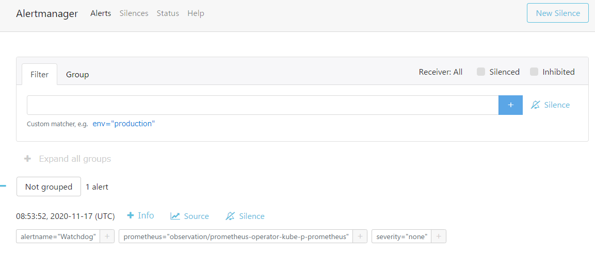
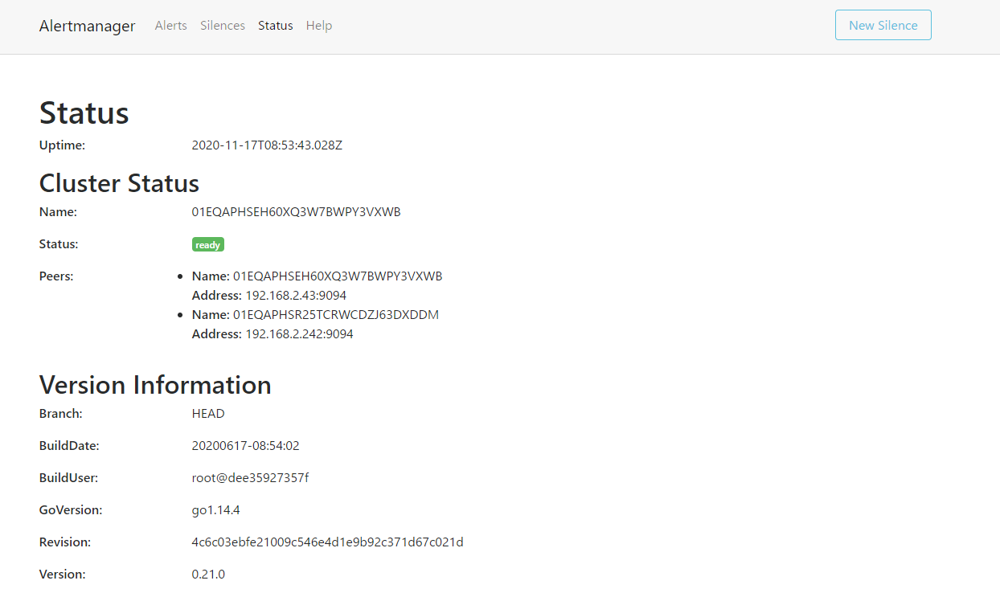
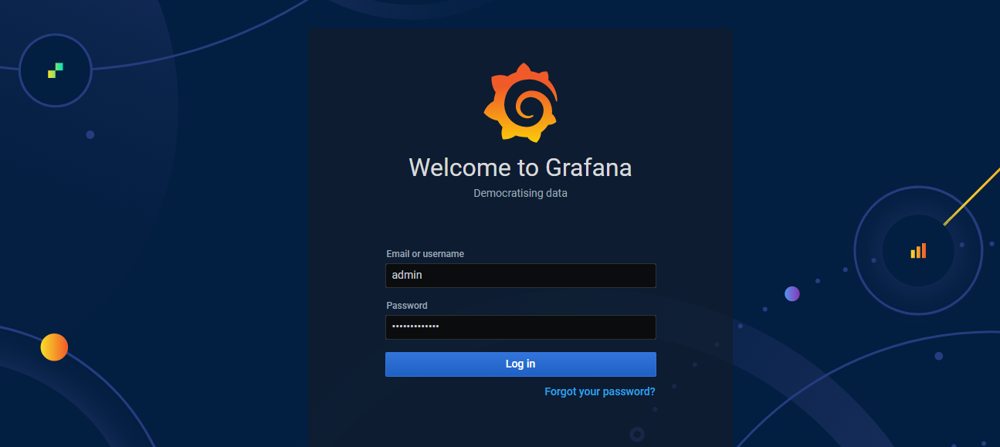
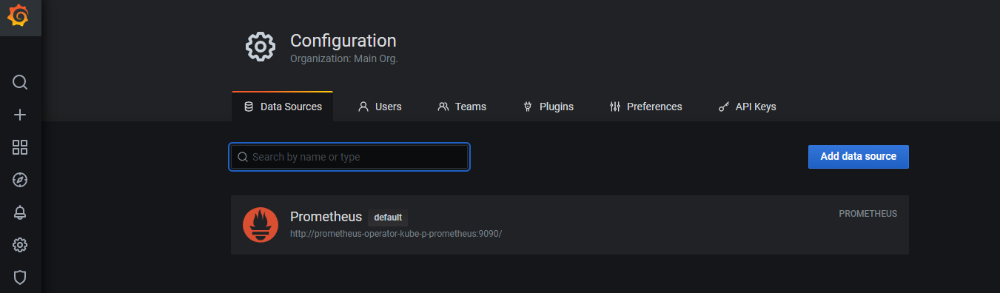
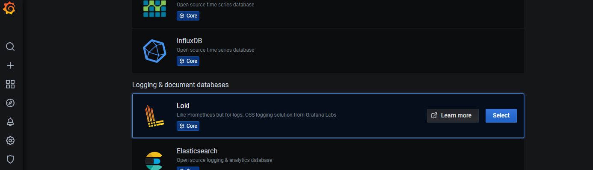
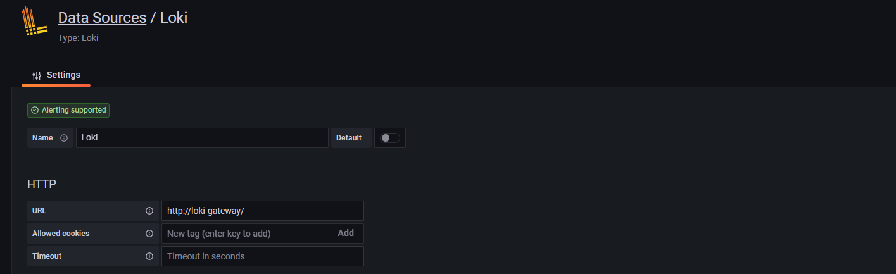

# セットアップ

以下のプロダクトをKubernetesにデプロイする

- モニタリング
  - Prometheus-Operator
    - Prometheus
    - Alertmanager
    - Grafana
    - Node-Exporter
    - kube-state-metrics
- ロギング
  - GrafanaLoki
  - Promtail
- トレーシング
  - TODO

## 前提

ローカルでkubectlが実行できること  
kubernetesにArgoCDがデプロイされていること

## 事前準備

EKSの場合、デフォルトでメトリクスサーバーのPodがデプロイされていないため、デプロイしておく。

[導入手順はmetrics-serverのドキュメントを参照](../../metrics-server/README.md)

## リポジトリのclone

```bash
git clone https://github.com/nautible/nautible-plugin.git
cd nautible-plugin
```

## CRDのデプロイ

実行

```bash
kubectl apply -f observation/prometheus-operator/application-crd.yaml
```

確認

```bash
kubectl get crd

NAME                                         CREATED AT
alertmanagerconfigs.monitoring.coreos.com    2020-11-13T05:52:49Z
alertmanagers.monitoring.coreos.com          2020-11-13T05:52:57Z
podmonitors.monitoring.coreos.com            2020-11-13T05:53:04Z
probes.monitoring.coreos.com                 2020-11-13T05:53:11Z
prometheuses.monitoring.coreos.com           2020-11-13T05:53:18Z
prometheusrules.monitoring.coreos.com        2020-11-13T05:53:25Z
servicemonitors.monitoring.coreos.com        2020-11-13T05:53:32Z
thanosrulers.monitoring.coreos.com           2020-11-13T05:53:40Z
```

CRDは上記以外にもあるため、kubectl get crdの結果に上記8個が含まれているかを確認する

## 一括デプロイ

Prometheus-Operator,GrafanaLoki,Promtail,ServiceMonitor,PrometheusRuleを一括デプロイする

```bash
kubectl apply -f observation/application.yaml
```

## 個別デプロイ

### prometheus-operatorのデプロイ

- 実行

```bash
kubectl apply -f observation/prometheus-operator/application.yaml
```

- Prometheus確認

```bash
kubectl port-forward svc/prometheus-operated -n monitoring 9090:9090
```

- ブラウザでアクセス

```bash
http://localhost:9090
```

デフォルトではアラート確認用にWatchdogが常にエラーとして検出される  
※環境によりそのほかのアラートが出る場合もある（メモリの使い過ぎ、Podが多すぎるなど）  


- Alertmanager確認

```bash
kubectl port-forward svc/alertmanager-operated -n monitoring 9093:9093
```

- ブラウザでアクセス

```bash
http://localhost:9093
```

Prometheusで確認したWatchdogのアラートがこちらも表示される  





- Grafana確認

```bash
kubectl port-forward svc/grafana -n monitoring 3000:3000
```

- ブラウザでアクセス

```bash
http://localhost:3000
```

デフォルトのログインID/PWはadmin/admin



デフォルトでPrometheusが設定されている



### GrafanaLokiのデプロイ

- 実行

```bash
kubectl apply -f observation/loki/application.yaml
```

- 確認

GrafanaLokiのserviceを表示してサービス名とPORTを確認

```bash
kubectl get svc -n monitoring

NAME                                           TYPE        CLUSTER-IP       EXTERNAL-IP   PORT(S)                      AGE
loki                                           ClusterIP   10.100.84.148    <none>        3100/TCP                     8m26s
```

上記で確認したサービス名:PORTでPrometheusのデータソースにLokiを追加する  





### promtailのデプロイ

- 実行

```bash
kubectl apply -f observation/promtail/application.yaml
```

- 確認

```bash
kubectl get ds -n monitoring

NAME                                           DESIRED   CURRENT   READY   UP-TO-DATE   AVAILABLE   NODE SELECTOR   AGE
promtail                                       3         3         3       3            3           <none>          32s
```

### ServiceMonitorのデプロイ

- 実行

```bash
kubectl apply -f observation/monitors/application.yaml
```

### PrometheusRulesのデプロイ

モニタリングルールのデプロイ

- 実行

```bash
kubectl apply -f observation/rules/application.yaml
```
